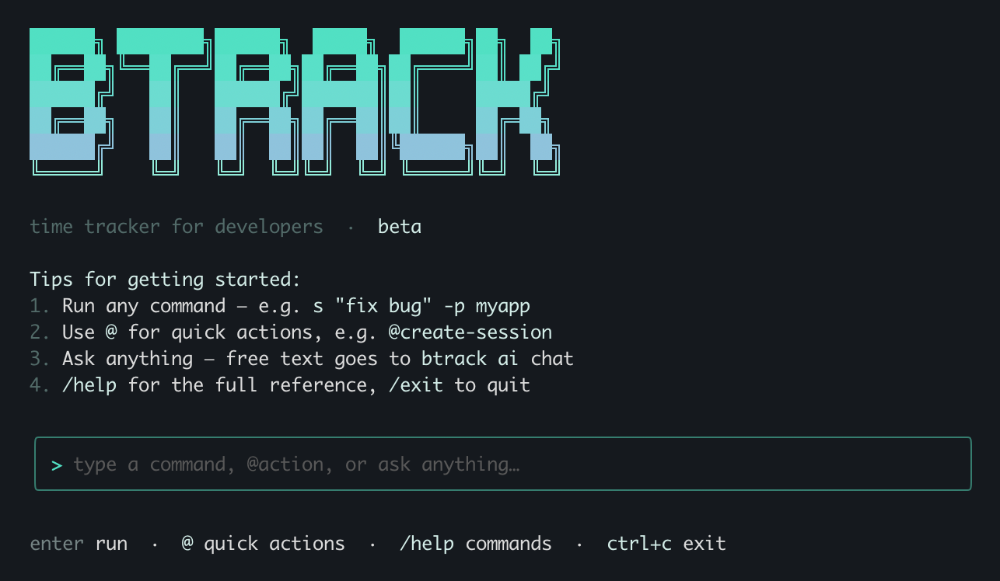

# btrack

Every time tracker I tried wanted me to open a browser, log in, pick a workspace, and click through a dashboard. I just wanted to type one line and get back to work.

[](https://github.com/tolgazorlu/btrack/releases/latest)
[](LICENSE)
[](go.mod)

<p align="center">
  
</p>

---

## Install

**macOS / Linux**
```bash
brew install tolgazorlu/btrack/btrack
```

**Windows**
```powershell
irm https://raw.githubusercontent.com/tolgazorlu/btrack/main/install.ps1 | iex
```

**Go**
```bash
go install github.com/tolgazorlu/btrack@latest
```

Or grab a binary from [Releases](https://github.com/tolgazorlu/btrack/releases/latest).

---

## Quick start

```bash
btrack s "fix login bug"              # start tracking
btrack n "found the issue"            # add a note while working
btrack x -m "fixed JWT clock skew"   # stop and save
btrack h                              # see today's work
```

---

## Commands

### Core

| Command | Alias | What it does |
|---------|-------|--------------|
| `btrack start "task"` | `s` | Start a session |
| `btrack start "task" -p myapp` | `s -p` | Start in a project |
| `btrack note "text"` | `n` | Add a note to the active session |
| `btrack note "text" -i 42` | `n -i` | Add a note to a past session |
| `btrack stop -m "msg"` | `x` | Stop and save |
| `btrack stop --at "2h ago"` | `x --at` | Stop, backdated |
| `btrack switch "new task"` | `sw` | Stop current, start new |
| `btrack resume` | `r` | Continue last session |

### History

All history flows through `btrack h`:

```bash
btrack h                  # today (default)
btrack h yesterday
btrack h 2026-05-01
btrack h -w               # this week
btrack h -m               # this month
btrack h -y               # this year
btrack h -n 20            # last 20 sessions as a table
btrack h -n 20 -v         # with notes
btrack h -l 5             # last 5 hours
btrack h -n 50 -p myapp   # filter by project
```

### Other views

```bash
btrack w                  # live status TUI
btrack stats              # today / week / month snapshot
btrack search "JWT"       # full-text search
btrack tag #bugfix        # filter by tag
```

---

## Projects

Group sessions by project and filter history by it.

```bash
btrack s "fix auth" -p myapp        # start session in a project
btrack projects                      # list all projects with total time
btrack h -n 50 -p myapp             # history filtered by project
btrack config project myapp rate 150 # record an hourly rate
```

### .btrack file

Drop a `.btrack` file in a repo root to set per-project defaults. `btrack s` picks it up automatically.

```bash
btrack init   # interactive wizard — creates .btrack for you
```

```ini
# .btrack
project     = myapp
task_prefix = [myapp]
daily_hours = 6
```

---

## Editing sessions

```bash
btrack h -n 20                        # find session IDs
btrack edit 42 -t "new task name"
btrack edit 42 --start 09:00 --end 17:30
btrack edit 42 -p myapp -m "done #bugfix"
```

---

## Shell prompt

Show the active session in your terminal prompt. Outputs nothing when idle.

```bash
btrack shell zsh    # print ready-to-paste zsh snippet
btrack shell bash   # print ready-to-paste bash snippet
btrack shell fish   # print ready-to-paste fish snippet
```

**Zsh** — add to `~/.zshrc`:
```zsh
btrack_prompt() { btrack prompt 2>/dev/null; }
RPROMPT='$(btrack_prompt)'
```

**Bash** — add to `~/.bashrc`:
```bash
btrack_prompt() {
  local s=$(btrack prompt 2>/dev/null)
  [ -n "$s" ] && echo " $s"
}
PS1='\u@\h \w$(btrack_prompt) \$ '
```

**Fish** — add to `~/.config/fish/functions/fish_right_prompt.fish`:
```fish
function fish_right_prompt
  btrack prompt 2>/dev/null
end
```

**Starship** — add to `~/.config/starship.toml`:
```toml
[custom.btrack]
command = "btrack prompt --format starship"
when    = "btrack prompt"
format  = "[$output]($style) "
style   = "blue"
```

Result: `fix login bug · 23m` on the right side of your prompt.

---

## Claude Skill

The bundled `btrack` skill teaches Claude Code to track your sessions on its own — start a session before non-trivial coding work, drop checkpoint notes for non-obvious findings, and stop it with a closing message when the work is done. It drives btrack through ordinary shell commands, so there's nothing else to register.

**Install — pick one:**

```bash
btrack skill install                 # writes ~/.claude/skills/btrack/, no Node required
```

```bash
npx skills add tolgazorlu/btrack     # via skills.sh — same destination
```

Both write the same files: `SKILL.md`, `README.md`, `metadata.json`, plus a `references/` directory with deep-dive docs. Fully quit and reopen Claude Code so it loads the skill.

**Other skill commands:**

```bash
btrack skill print       # dump SKILL.md to stdout
btrack skill path        # print the install path
btrack skill install --force   # overwrite a customized skill on upgrade
```

The skill source lives in [`skills/btrack/`](skills/btrack/).

---

## Configuration

```bash
btrack config                # show all settings
btrack config hours 6        # daily hour target
btrack config idle 15        # auto-stop after 15 min idle (0 = off)
btrack config max-hours 12   # hard cap on one session (0 = off)
```

Config file: `~/.config/btrack/config.yaml`. Sessions are stored in a local SQLite database.

---

## Export

```bash
btrack export                              # CSV to stdout
btrack export --format json --out data.json
btrack export --days 30 --out may.csv
```

---

## Client reports

`btrack report` builds the document you hand a client when you invoice them:
what you committed, and how long it took. Two parts, one HTML file.

```bash
btrack report myclient --from 21.08 --to 16.09   # a billing period
btrack report myclient -m                        # this month
btrack report myclient --from 01.09 --open       # open it when done
```

Part 1 reads the git history of the repository you run it in: every non-merge
commit, grouped by day, tagged feat/fix/chore/revert, with the pull request
that merged it. Part 2 reads your btrack sessions for the same range, with
per-day and grand totals.

The file lands in your home directory. `--out` puts it elsewhere, `--repo`
scans a repository other than the current directory, and `--client` sets the
name printed on the masthead.

In the interactive console the same thing is `/report` (or `/rapor`).

### Backfilling hours you tracked elsewhere

If your hours live in a stopwatch app or a spreadsheet, import them once and
the report can build itself from then on. The file is one record per line,
tab- or comma-separated — date, duration, description:

```
21.08.2026    1.00.46     Request triage + reservation editing + test + deploy
24.08.2026    24.09.27    Pattern sort + test + deploy
24.08.2026    15m43s      Mobile app bug review [no commit]
```

```bash
btrack import hours.tsv -p myclient --dry-run   # show what would happen
btrack import hours.tsv -p myclient             # write it
```

Durations accept the forms people actually write by hand: `1.00.46`,
`24.09.27`, `1:09:20`, `45m29s`, `1 sa 9 dk`, `0.75h`. A trailing `[note]` in
the description becomes a chip beside the entry in the report. Always run
`--dry-run` first.

---

## Build from source

```bash
git clone https://github.com/tolgazorlu/btrack.git
cd btrack
go build -o btrack .
```

---

## License

MIT
